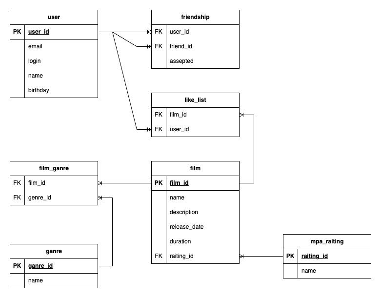

# java-filmorate project

## ER - диаграмма


## Запросы к БД 
### Получение спсика всех фильмов пользователя
``` roomsql
SELECT film_id   
  FROM like_list   
  INNER JOIN film ON like_list.filmid = film.film_id   
WHERE user_id = {user_id}  
```
### Получение спсика всех фильмов пользователя
``` roomsql
SELECT film_id  
  FROM like_list INNER JOIN film ON like_list.filmid = film.film_id  
WHERE user_id = {user_id}  
```
### Получение спсика топ - N популярных фильмов
``` roomsql
SELECT  film.*  
       ,COUNT(film_id) AS count_likes  
FROM like_list INNER JOIN film ON like_list.filmid = film.film_id  
GROUP BY film.*  
ORDER BY count_likes DESC  
LIMIT {N}   
```
### Получение спсика получение списка общих друзей
``` roomsql
SELECT u.*  
FROM user AS u  
INNER JOIN friendship AS f1 ON f1.friend_id = u.user_id  
                            AND u.user_id = {otherId}  
WHERE EXISTS(SELECT *   
               FROM friendship AS f2   
             WHERE f2.user_id = {id}   
               AND f2.friend_id = f1.friend_id)   
```
